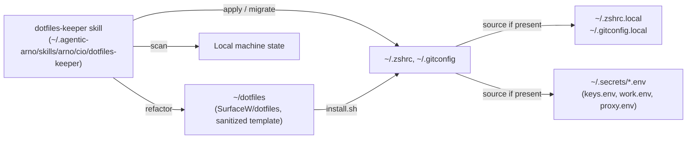

# Dotfiles Keeper — Skill + Repo Refactor

## Convention (binding for both skill and repo)

- Repo path: `~/dotfiles` on every machine.
- Template files (sanitized, in repo): `zshrc/.zshrc`, `.gitconfig`, `.vimrc`, `brew.sh`, `install.sh`.
- Live files (machine-local, gitignored): `~/.zshrc.local`, `~/.gitconfig.local`, `~/.secrets/*.env`.
- Secrets: never in repo. Live in `~/.secrets/*.env` (mode `600`), each sourced if present.
- Placeholders in templates: `****`, `<your-...>`, or commented `# fill in: ...` lines.

## Architecture



## Deliverables

### 1. Skill files at [~/.agentic-arno/skills/arno/cio/dotfiles-keeper/](/Users/ArnoYe/.agentic-arno/skills/arno/cio/dotfiles-keeper/)

- **`SKILL.md`** — frontmatter + main instructions. Sections:
  - Convention (path, naming, secrets policy)
  - Workflow A: **Scan** (read `~/.zshrc`, `~/.gitconfig`, `~/.vimrc`, brew list, plugin list; diff vs `~/dotfiles/`)
  - Workflow B: **Refactor template** (extract reusable parts from local → repo, with secret-stripping rules)
  - Workflow C: **Apply / migrate** (install.sh on a fresh machine; merge missing pieces on an existing one)
  - Workflow D: **Secrets routing** (`~/.secrets/{keys,work,proxy}.env`, mode 600)
  - Workflow E: **Bootstrap a new machine** (Homebrew → zsh → oh-my-zsh → plugins → symlink)
  - Anti-patterns (no secrets in repo, no hardcoded `/Users/<name>` paths, no duplicate `source $ZSH/oh-my-zsh.sh`, no time-sensitive instructions)
- **`reference.md`** — sensitive-pattern regex list, refactor checklist, plugin/brew install matrix, troubleshooting.
- **`template-zshrc-spec.md`** — canonical structure for `zshrc/.zshrc` (numbered sections, what belongs where).

Skill follows `create-skill` rules: third-person description with trigger terms ("manage dotfiles", "sync zshrc", "bootstrap new mac", "dotfiles-keeper"), `disable-model-invocation: true`, body under 500 lines, progressive disclosure to the two reference files.

### 2. Refactored repo at [~/dotfiles/](/Users/ArnoYe/dotfiles/)

- **[zshrc/.zshrc](/Users/ArnoYe/dotfiles/zshrc/.zshrc)** — full rewrite:
  - Replace hardcoded `export ZSH=/Users/arno/.oh-my-zsh` (line 1) with `export ZSH="$HOME/.oh-my-zsh"`.
  - Remove duplicate `source $ZSH/oh-my-zsh.sh` (currently lines 63 + 164 in local copy).
  - Drop dead blocks: GHC 7.10.3 (lines 127-132), PHP 5.6, Alibaba `tnpm` aliases, `aliases.bash` showa, hardcoded `mysql/bin` PATH.
  - Move forced `http_proxy` / `https_proxy` / `ALL_PROXY` (lines 469-471) into `~/.secrets/proxy.env` and source conditionally.
  - Replace hardcoded `PNPM_HOME="/Users/arno/Library/pnpm"` (line 474) with `"$HOME/Library/pnpm"`.
  - Replace `JAVA_HOME=".../jdk1.8.0_291.jdk/..."` (line 461) with `$(/usr/libexec/java_home 2>/dev/null)` guarded.
  - Append at the end:
    ```bash
    # Local secrets (gitignored; mode 600)
    for f in "$HOME"/.secrets/*.env; do [ -r "$f" ] && source "$f"; done

    # Machine-local overrides
    [ -r "$HOME/.zshrc.local" ] && source "$HOME/.zshrc.local"
    ```
  - Keep the well-organized 9 sections (Environment, Terminal, File mgmt, Searching, Process, Networking, System, Web, Notes) — they're the good bones.

- **[brew.sh](/Users/ArnoYe/dotfiles/brew.sh)** — rewrite as a working idempotent installer:
  - Fix typos: `homebrew/depes` → `dupes` (or drop, since these taps are deprecated).
  - Fix `brew install vim --overide-system-vi` → `--with-override-system-vi` (or drop; modern vim is fine).
  - Drop `homebrew/php/php55`.
  - Add modern essentials: `git`, `bash`, `bash-completion`, `vim`, `wget`, `tree`, `jq`, `ripgrep`, `fd`, `fzf`, `autojump`, `node`, `python@3.13`, `nvm`, `pnpm`.
  - Make idempotent with `brew list <pkg> &>/dev/null || brew install <pkg>`.

- **New [install.sh](/Users/ArnoYe/dotfiles/install.sh)** — one-shot bootstrap:
  1. Install Xcode CLT if missing.
  2. Install Homebrew if missing.
  3. Run `brew.sh`.
  4. Install oh-my-zsh if missing.
  5. Install zsh plugins: `zsh-autosuggestions`, `zsh-syntax-highlighting`.
  6. Symlink `zshrc/.zshrc` → `~/.zshrc`, `.gitconfig` → `~/.gitconfig`, `.vimrc` → `~/.vimrc` (with `.bak` backup of any existing).
  7. Create `~/.secrets/` (mode `700`) with `keys.env.example`, `work.env.example`, `proxy.env.example` skeletons containing `****` placeholders.
  8. Create empty `~/.zshrc.local` if absent.
  9. Set zsh as default shell if not already.

- **[.gitconfig](/Users/ArnoYe/dotfiles/.gitconfig)** — mask sensitive parts:
  - `name = ****` and `email = ****@****` (current shows real Alibaba name/email).
  - Add `[include] path = ~/.gitconfig.local` so each machine sets identity locally.
  - Drop the `media`, `hawser`, and `lfs` filter blocks if no longer used; keep `lfs` if relevant.
  - Fix `excludesfile = /Users/yeqingnan/.gitignore_global` → `~/.gitignore_global`.

- **[README.md](/Users/ArnoYe/dotfiles/README.md)** — short rewrite:
  - Convention (`~/dotfiles`).
  - One-liner install: `git clone … ~/dotfiles && cd ~/dotfiles && bash install.sh`.
  - Secrets policy (`~/.secrets/*.env`, never committed).
  - Pointer to skill at `~/.agentic-arno/skills/arno/cio/dotfiles-keeper/SKILL.md` for AI-assisted maintenance.

- **[.gitignore](/Users/ArnoYe/dotfiles/.gitignore)** — already exists; verify it ignores `*.local`, `.secrets/`, `*.env` if it doesn't already.

### 3. Live machine migration (post-skill)

Use the skill's Workflow C to:
- Diff current `~/.zshrc` (575 lines) vs new template — pull in the extras (node@22, python@3.13, `.local/bin/env`) into the template if reusable; otherwise keep them in `~/.zshrc.local`.
- Move secrets out of `~/.zshrc` lines 567-573 (`IDENTITY_TOKEN`, `GEMINI_API_KEY`, `FMP_API_KEY`, `USER`) into `~/.secrets/keys.env` and `~/.secrets/work.env`, mode 600.
- After migration, the user's live `~/.zshrc` becomes a thin file (or symlink) that sources template + secrets + local overrides.

## Order of operations (when user approves)

1. Write the three skill files.
2. Refactor `zshrc/.zshrc`, `brew.sh`, `.gitconfig`, `README.md`; add `install.sh`.
3. Verify `.gitignore` covers secrets.
4. Surface a migration checklist for the live machine — but only run it (move secrets, swap `~/.zshrc`) after explicit user OK, since it touches their active shell.

## Out of scope (this pass)

- `proxy/config.clash.yaml` — leave as-is; not a dotfile concern.
- `bash/*.sh` helpers — leave as-is.
- `.vimrc` — leave as-is (no secrets in it).
- Linux/WSL parity — macOS-only for now (matches current usage).
